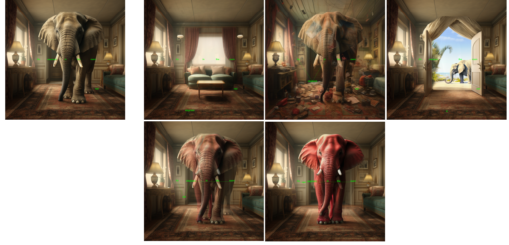
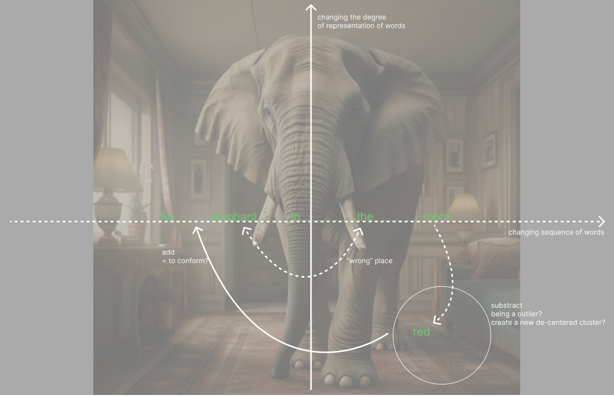
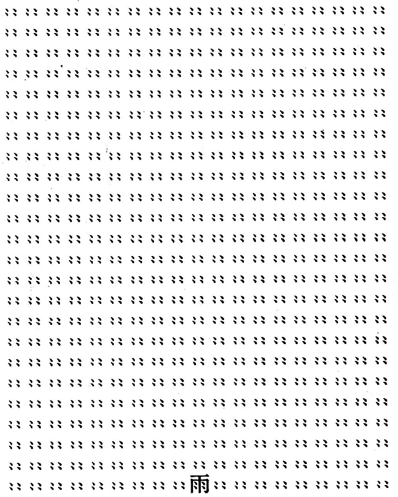

# thesis_makings

#### [Introduction] 

------

**P5.js prototype**

Try it out [here](https://editor.p5js.org/yrqian99/full/nrfi7UNJ9).

------

**User Testing**

What is primarily my design in this prototype is to enable the words to be moved away from the structured sentence, and to let the audience see what would happen if the elephant is running away from the sentence. It works well. But there's something else emerging after inviting people to try out the prototype, here are some of my observations:

1. **Disturb sentence structure:** There's a high tendency for people to try dragging the words horizontally to change the sequence of the word. They would like to see what would happen if "A room in the elephant". (x axis)

2. **Sentence as a space:** Moving up and down seems to cast a difference other than just moving the word away. In this sense, it shows that there is a tendency for people to "see" the words than just "read" them. For example, some people states that moving the word "elephant" up will generate a image in which elephant is flying in the sky, whereas moving "elephant" down might be result in a image of elephant walking. This observation prompts me to think the sentence as a space, and the use of space to communicate as much or more than written language itself could do.

3. **At the "wrong" spot:** Since I place a word "red" down below the sentence at the right corner of the canvas, Some people might not see it at first glance. After seeing it, their first move is to drag the word either before "room" or "elephant" to add it to the sentence. It all make sense until one person start to place the word in the "wrong" spot like these: "An elephant red in the room.""An elephant in the room red." I cannot stop wondering what change would it make to have words added in a sentence at a spot where they are "not supposed" to be at. ("bad English")

4. **Seek the outliers:** Adding on to point 3, some people also wanted to drag a word out from the sentence to company the "red" to make a stand-alone phrase "red elephant" outside of the original sentence.

   

S Cearley in their "How to Read a Concrete Poem" says: 

> Your experience with poems, like all literature, requires you start at A, and read through, to the end, B. But the concrete poem is silent and motionless. It does not move in time, does not go from A to B. The meaning of a concrete poem is no longer tethered to its linear movement through time, from the beginning of you viewing, to the end. because it's free, its meaning is free.

Our learnt grammar of a language has grounded our experience with a sentence in a linear manner. Not only in literature, but in movies, music, acting; the linear requirements determine the narrative of the work. Narratives, these stories, rely on the passage of time, feeling time unfold as we move through it along the story. In the concrete poem, however, there is no unfolding time. The entirety of the story is presented instantaneously, because of its spatiality.

*Ame* by *Seiichi Neiikuni*

This poem, Ame, by Seiichi Neiikuni, is a large, dwarfing field of drops, seemingly falling down onto the character at the bottom. You might describe it as a small building. Different people might read this poem differently, especially for who can read the meaning of the Chinese character "雨" versus for those who don't. And yet it is easy to see how we see rain without being told of the rain, without reading the rain. There's no linearity in this poem, we view it as a whole, taking it in. We can view small part of it, consider the small portion as a part of the whole, the view another part of it. This how we might experiencing a rainy scene in real life.

To open up more freedom in the computational text input system, I would like to incorporate the spatial component of concrete poetry into the next step of my prototype, which I have done partially in the earlier stage. And yet, since the reader of this input, in the context of my prototype, will be the the text encoder algorithm used in text-to-image generator, how the algorithm would take this input and transform into image would be the biggest question for me to consider.
